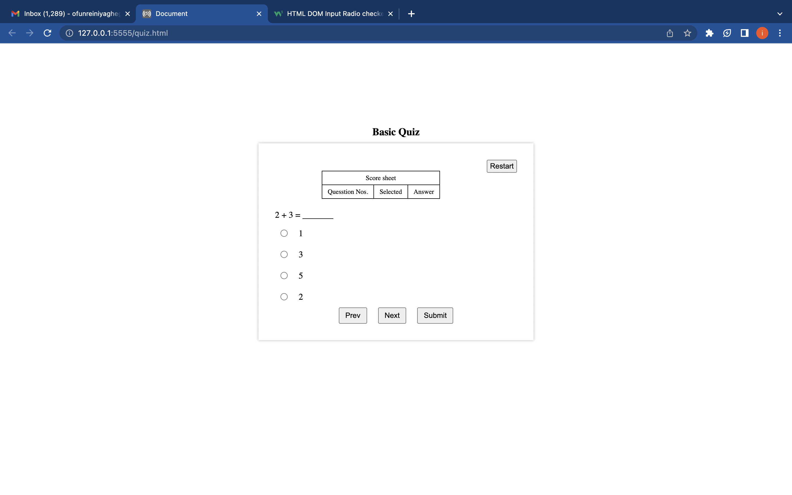
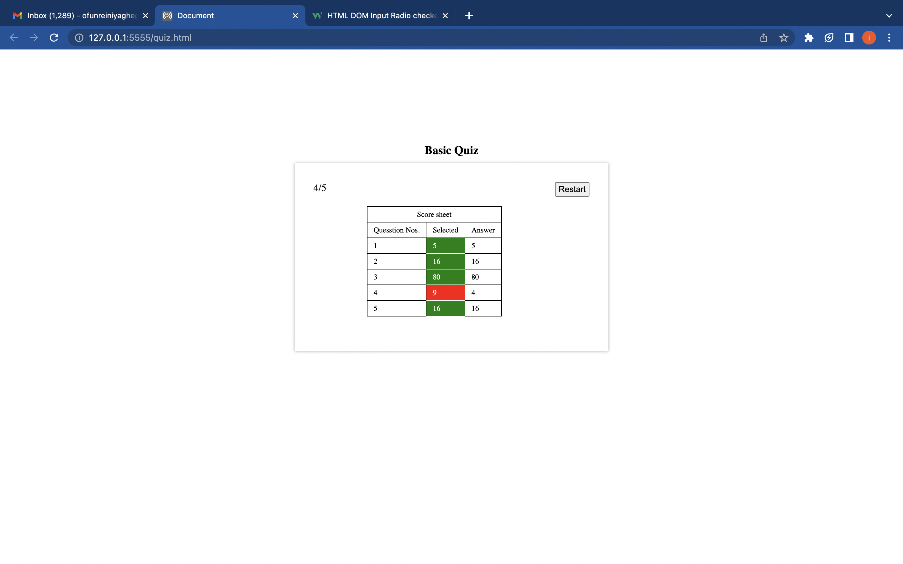

# A basic pure vanilla javascript Quiz app

### Brief Description.

1.  The app rememb ser selected option even after paginating away from it.
2.  After submission correct options selected are mark with green while wrong options are marked with red, and display on thye score sheet.

